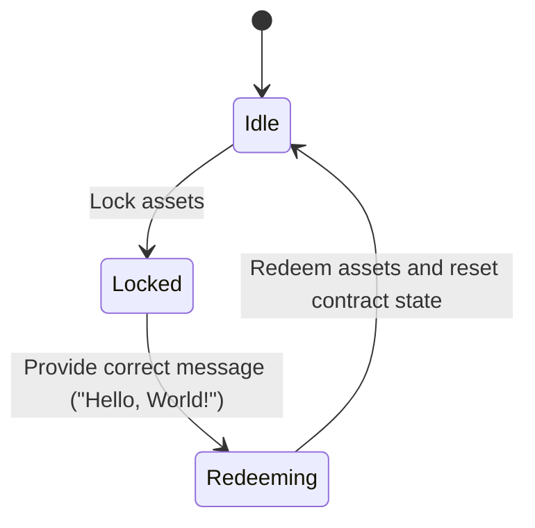
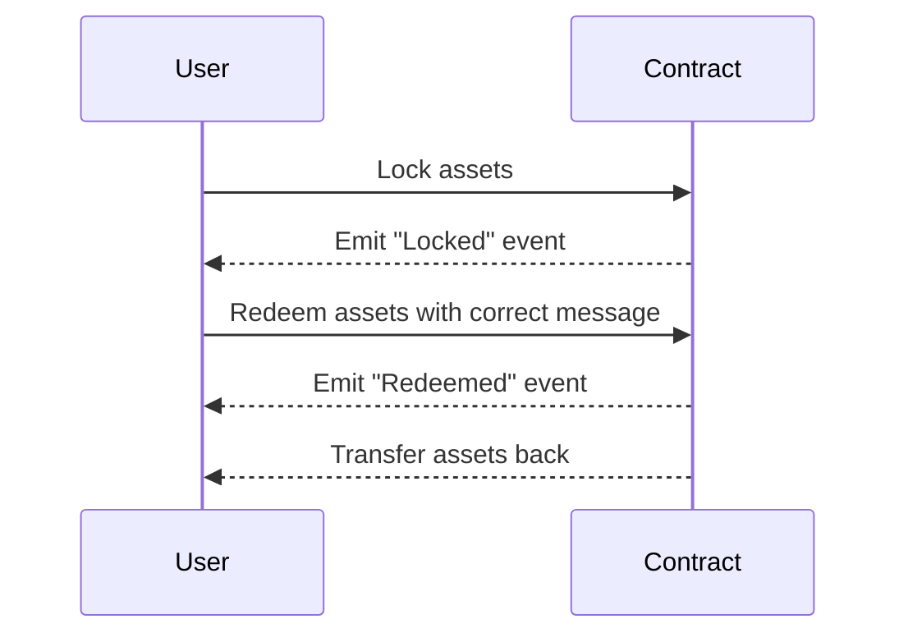

# LockUnlockSmartContract

A simple smart contract to lock-and-unlock assets.

## Key Features

| Feature               | Description                                          |
|---------------------------|----------------------------------------------------------|
| Single Asset Locking      | - Only one account can lock assets at a time             |
|                           | - Requires non-zero token transfer during locking        |
| Message-Based Redemption  | - Requires exact match of "Hello, World!" message        |
|                           | - Only original locker can redeem                        |
| State Safety              | - Prevents double-locking                                |
|                           | - Resets state after redemption                          |

## Data Structure  

| Structure          | Type                 | Description                                         |
|--------------------|----------------------|-----------------------------------------------------|
| `locker`           | `Option<AccountId>`  | Stores address of current locker (`None` if empty)  |
| `locked_amount`    | `Balance`            | Amount of native tokens locked                      |
| **Error** enum     | Custom errors        | 5 variants covering all failure scenarios           |
| **Locked** event   | Event log            | Records locker address + amount on success          |
| **Redeemed** event | Event log            | Tracks redemption details                           |

## Functions Overview

### `lock()` - Lock Asset

**Key Points**:

- Checks no existing lock
- Records sender's address  
- Stores sent token amount  
- Emits `Locked` event

### `redeem()` - Redeem Asset

**Key Points**:  

- Identity check
- Message validation  
- Safe token transfer  
- State reset

## State Diagram

The state diagram shows the transitions between states based on user actions:

## Sequence Diagram

The sequence diagram illustrates the interactions between the user and the smart contract:

